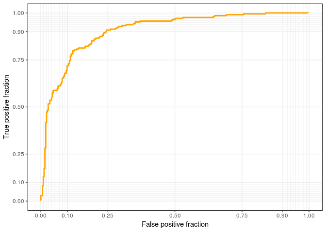
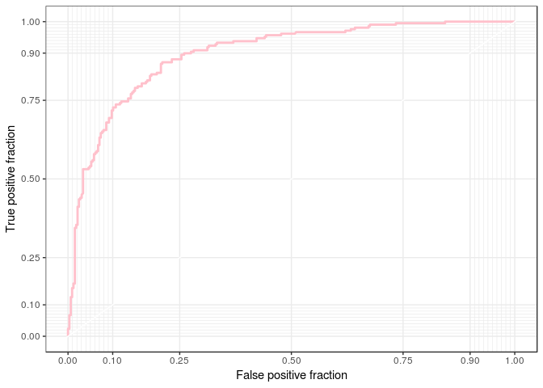
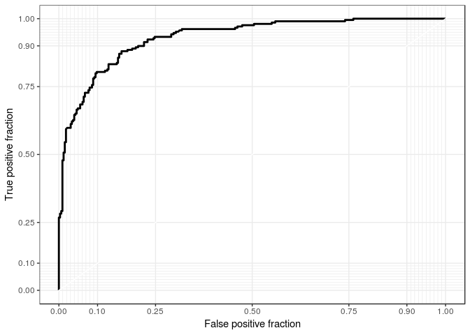

SVM\_Lab
================
Yao Liu
3/5/2019

1.  This question refers to Chapter 9 Problem 8 beginning on page 371 in the text.

    1.  Create a training sample that has roughly 80% of the observations. Use `set.seed(19823)`.

``` r
df <- tbl_df(OJ)
attach(df)
set.seed(19823)
inTraining <- createDataPartition(Purchase, p = .5, list = F )
training <- df[inTraining, ]
testing  <- df[-inTraining, ]
```

    b. Use the `kernlab` package to fit a support vector classifier to the 

training data using `C = 0.01`.

``` r
purchase_svm_m1 <- ksvm(Purchase ~ ., data = training,
                     type = "C-svc", kernel = 'vanilladot', 
                     C = 0.01, prob.model = T)  
```

    ##  Setting default kernel parameters

    c. Compute the confusion matrix for the training data. Report the overall 

error rates, sensitivity, and specificity.

``` r
confusionMatrix(table(predict(purchase_svm_m1, newdata = testing),testing$Purchase),positive = "MM")
```

    ## Confusion Matrix and Statistics
    ## 
    ##     
    ##       CH  MM
    ##   CH 300  63
    ##   MM  26 145
    ##                                         
    ##                Accuracy : 0.8333        
    ##                  95% CI : (0.799, 0.864)
    ##     No Information Rate : 0.6105        
    ##     P-Value [Acc > NIR] : < 2.2e-16     
    ##                                         
    ##                   Kappa : 0.6379        
    ##  Mcnemar's Test P-Value : 0.0001356     
    ##                                         
    ##             Sensitivity : 0.6971        
    ##             Specificity : 0.9202        
    ##          Pos Pred Value : 0.8480        
    ##          Neg Pred Value : 0.8264        
    ##              Prevalence : 0.3895        
    ##          Detection Rate : 0.2715        
    ##    Detection Prevalence : 0.3202        
    ##       Balanced Accuracy : 0.8087        
    ##                                         
    ##        'Positive' Class : MM            
    ## 

    d. Construct the ROC curve. 

``` r
fits_svc <- predict(purchase_svm_m1, newdata = training, type = "probabilities")
new_fits <- mutate(training, 
                   svc_probs = fits_svc[,2],
                   default = if_else(Purchase == "CH", 0, 1))          
p <- ggplot(data = new_fits,
            aes(d = default , m = svc_probs))
p + geom_roc(n.cuts = 0, col = "orange") +
  style_roc()
```



    e. Use the `train` function from the `caret` package to find an optimal cost

parameter (`C`) in the range 0.01 to 10. Use `seq(0.01, 10, len = 20)`.

``` r
fit_control <- trainControl(method = "repeatedcv",
                           number = 10, 
                           repeats = 3)
purchase_train <- train(Purchase ~ .,
                     data = training,
                     method = "svmLinear",     #apply hyperplane here 
                     trControl = fit_control,
                     tuneGrid = data.frame(C = seq(0.01,10,len  = 20))) #add the buffer area here. 10 means the larger area of buffer 
purchase_train 
```

    ## Support Vector Machines with Linear Kernel 
    ## 
    ## 536 samples
    ##  17 predictor
    ##   2 classes: 'CH', 'MM' 
    ## 
    ## No pre-processing
    ## Resampling: Cross-Validated (10 fold, repeated 3 times) 
    ## Summary of sample sizes: 482, 482, 483, 483, 482, 482, ... 
    ## Resampling results across tuning parameters:
    ## 
    ##   C           Accuracy   Kappa    
    ##    0.0100000  0.8259214  0.6272805
    ##    0.5357895  0.8240459  0.6265229
    ##    1.0615789  0.8265266  0.6318647
    ##    1.5873684  0.8252921  0.6292367
    ##    2.1131579  0.8234286  0.6254769
    ##    2.6389474  0.8246748  0.6280315
    ##    3.1647368  0.8259214  0.6306227
    ##    3.6905263  0.8265387  0.6318023
    ##    4.2163158  0.8252925  0.6297037
    ##    4.7421053  0.8259098  0.6309264
    ##    5.2678947  0.8240579  0.6271953
    ##    5.7936842  0.8240696  0.6269202
    ##    6.3194737  0.8234407  0.6255153
    ##    6.8452632  0.8234407  0.6251890
    ##    7.3710526  0.8240463  0.6266026
    ##    7.8968421  0.8240463  0.6266026
    ##    8.4226316  0.8240347  0.6266052
    ##    8.9484211  0.8215301  0.6216055
    ##    9.4742105  0.8221591  0.6228205
    ##   10.0000000  0.8215418  0.6214402
    ## 
    ## Accuracy was used to select the optimal model using the largest value.
    ## The final value used for the model was C = 3.690526.

    f. Compute the training and test classification error.

``` r
confusionMatrix(table(predict(purchase_train , newdata = testing), 
                      testing$Purchase), positive = "MM")
```

    ## Confusion Matrix and Statistics
    ## 
    ##     
    ##       CH  MM
    ##   CH 294  62
    ##   MM  32 146
    ##                                          
    ##                Accuracy : 0.824          
    ##                  95% CI : (0.789, 0.8553)
    ##     No Information Rate : 0.6105         
    ##     P-Value [Acc > NIR] : < 2e-16        
    ##                                          
    ##                   Kappa : 0.6199         
    ##  Mcnemar's Test P-Value : 0.00278        
    ##                                          
    ##             Sensitivity : 0.7019         
    ##             Specificity : 0.9018         
    ##          Pos Pred Value : 0.8202         
    ##          Neg Pred Value : 0.8258         
    ##              Prevalence : 0.3895         
    ##          Detection Rate : 0.2734         
    ##    Detection Prevalence : 0.3333         
    ##       Balanced Accuracy : 0.8019         
    ##                                          
    ##        'Positive' Class : MM             
    ## 

    g. Repeat (b) - (d) using an SVM with a polynomial kernel with degree 2. 

``` r
purchase_ply <- ksvm(Purchase ~ ., 
               data = training,
               type = "C-svc", kernel = 'polydot', 
               kpar = list(degree = 2, scale = .1),   #a polynomial kernel with degree 2
               C = .01, prob.model = T)

fits_svm <- predict(purchase_ply, newdata = training, type = "probabilities")
svm_pred <- mutate(new_fits, svm_probs = fits_svm[, 2])
p <- ggplot(data = svm_pred,
            aes(d = default, m = svm_probs))
p + geom_roc(n.cuts = 0, col = "pink") +
  style_roc()
```



``` r
confusionMatrix(table(predict(purchase_ply, newdata = testing), 
                      testing$Purchase), positive = "MM")
```

    ## Confusion Matrix and Statistics
    ## 
    ##     
    ##       CH  MM
    ##   CH 316 112
    ##   MM  10  96
    ##                                           
    ##                Accuracy : 0.7715          
    ##                  95% CI : (0.7335, 0.8065)
    ##     No Information Rate : 0.6105          
    ##     P-Value [Acc > NIR] : 1.804e-15       
    ##                                           
    ##                   Kappa : 0.4728          
    ##  Mcnemar's Test P-Value : < 2.2e-16       
    ##                                           
    ##             Sensitivity : 0.4615          
    ##             Specificity : 0.9693          
    ##          Pos Pred Value : 0.9057          
    ##          Neg Pred Value : 0.7383          
    ##              Prevalence : 0.3895          
    ##          Detection Rate : 0.1798          
    ##    Detection Prevalence : 0.1985          
    ##       Balanced Accuracy : 0.7154          
    ##                                           
    ##        'Positive' Class : MM              
    ## 

    i. Repeat (b) - (d) using an SVM with a radial basis kernel. Train it. 

``` r
purchase_svm_rad <- ksvm(Purchase ~ ., data = training,
                   type = "C-svc", kernel = 'rbfdot', 
                   kpar = list(sigma = .1), 
                   prob.model = T)
fits_svm_rad <- predict(purchase_svm_rad, newdata = training, type = "probabilities")

svm_pred_rad <- mutate(svm_pred, svm_probs_rad = fits_svm_rad[, 2])
p <- ggplot(data = svm_pred_rad,
            aes(d = default, m = svm_probs_rad))
p + geom_roc(n.cuts = 0) +
  style_roc() 
```



``` r
confusionMatrix(table(predict(purchase_svm_rad, newdata = testing), 
                      testing$Purchase), positive = "MM")
```

    ## Confusion Matrix and Statistics
    ## 
    ##     
    ##       CH  MM
    ##   CH 297  59
    ##   MM  29 149
    ##                                          
    ##                Accuracy : 0.8352         
    ##                  95% CI : (0.801, 0.8657)
    ##     No Information Rate : 0.6105         
    ##     P-Value [Acc > NIR] : < 2.2e-16      
    ##                                          
    ##                   Kappa : 0.6442         
    ##  Mcnemar's Test P-Value : 0.001992       
    ##                                          
    ##             Sensitivity : 0.7163         
    ##             Specificity : 0.9110         
    ##          Pos Pred Value : 0.8371         
    ##          Neg Pred Value : 0.8343         
    ##              Prevalence : 0.3895         
    ##          Detection Rate : 0.2790         
    ##    Detection Prevalence : 0.3333         
    ##       Balanced Accuracy : 0.8137         
    ##                                          
    ##        'Positive' Class : MM             
    ## 

1.  Train one of the SVM models using a single core, 2 cores, and 4 cores. Compare the speedup (if any).

``` r
registerDoMC(cores = 1)  # single core
svm_cor1 <- system.time(ksvm(Purchase ~ ., 
                         data = training,
                         type = "C-svc", kernel = 'polydot', 
                         kpar = list(degree = 2, scale = .1), 
                         C = .01, prob.model = T))
svm_cor1
```

    ##    user  system elapsed 
    ##   0.057   0.000   0.057

``` r
registerDoMC(cores = 2)  # 2 cores
svm_cor2 <- system.time(ksvm(Purchase ~ ., 
                         data = training,
                         type = "C-svc", kernel = 'polydot', 
                         kpar = list(degree = 2, scale = .1), 
                         C = .01, prob.model = T))
svm_cor2
```

    ##    user  system elapsed 
    ##   0.057   0.000   0.058

``` r
registerDoMC(cores = 4)  # 4 cores
svm_cor4 <- system.time(ksvm(Purchase ~ ., 
                         data = training,
                         type = "C-svc", kernel = 'polydot', 
                         kpar = list(degree = 2, scale = .1), 
                         C = .01, prob.model = T))
svm_cor4
```

    ##    user  system elapsed 
    ##   0.057   0.000   0.057

1.  You might want to look at `rbenchmark` or `microbenchmark` packages for timing.
